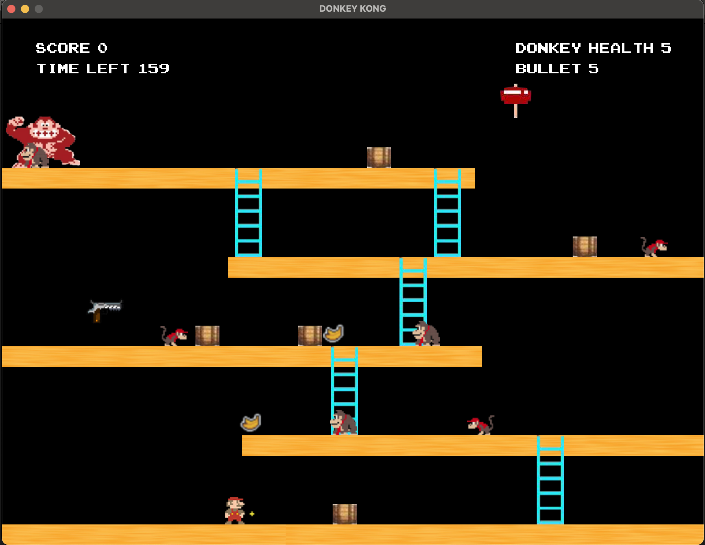

# **Shadow Donkey Kong Overview**
Shadow Donkey Kong is a classic platformer game built in Java, inspired by the original arcade-style Donkey Kong. Players control Mario to navigate obstacles, climb ladders, jump on platforms, and defeat Donkey Kong using hammers. The game features 2 levels, enemies, and interactive objects, demonstrating core object-oriented programming concepts and event-driven game mechanics.**

## **Features Implemented**
- **Player Mechanics**:
   - Walk, jump, and land on platforms
   - Ladder climbing (up and down)
   - Shooting projectiles (bullets) and collecting hammers
- **Enemies & Objects**:
   - Monkeys throwing bananas
   - Collision detection between Mario, enemies, barrels, and projectiles
- **Scoring & Gaming rules**:
   - Points awarded for hitting enemies or jumping over barrels
   - Projectiles deactivate on collision or leaving screen bounds
   - Timed levels with increasing difficulty
- **Game Logic / Assumptions**:
   - Mario cannot go beyond screen boundaries
   - Projectiles revert to normal when ammunition is zero
   - Destroying enemies also removes their active projectiles
   - Timer continues across levels

### **Tech Stack**
1. **Language**: Java
2. **IDE**: IntelliJ IDEA
3. **Version Control**: Git (originally GitLab, migrated to GitHub)
4. **Design**: Object-Oriented Programming, Event-driven Programming

### **How to Run**
1. Open the project in IntelliJ IDEA
2. Compile and run Main.java
3. Use arrow keys to move Mario, UP/DOWN to climb ladders, spacebar to jump, s to shoot bullets

---
### **Learning Outcomes**
1. Applied OOP principles such as inheritance, polymorphism, and encapsulation
2. Implemented collision detection and game physics for a 2D platformer
3. Managed game state, scoring, and interactions between multiple object types
4. Used Git for version control and project tracking

